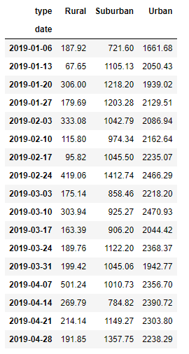
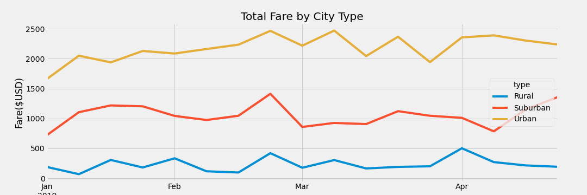

# Pyber_Analysis

In module 5, we analyzed rideshare data from different cities and different city types. For this challenge we created a new dataframe of ridesharing data by city type, took our new dataframe broke the data down even further then created a multiple line graph to show a visualization of our results. 

In the first section of the challenge, we took the pyber summary dataframe, grouped together the city types to get the total ride count, driver count, total fare price and the average fare price and the average fare per driver. After we got those numbers, we created a summary dataframe of that data we calculated. After we created the dataframe we formatted the dataframe to make the data presentable and in dollar format. Next we took that dataframe and made it into a piviot table with the .pitvot() function. After we created the pivot table, we took the .loc function and narrowed the data down the  January 1st and April 29th 2019 timeframe. Once we created the pivot table, we used the to_datetime function to set the date to datetime type. Once we did that, we were able to use the .resample() function to put the data into weekly bins then used the .sum() function to get the weekly sums of the fares per city type for the months specified. Once we created that dataframe, we were able to create our total fares by city type line chart. 

Resampled pivot table(weekly sum of fares):

As we can see by the data, the city type that had the highest fare total by week were the cities that fell into the urban category followed by suburban and rural. This is not surprising because the population and the need for ride sharing is higher in the urban and suburban than in rural areas. The population plays a big roll in the results as well. As we know the population is bigger in the urban and suburban than in rural areas. As far as total fares, we see that the sum of the urban stays between $2000 and $2500. The suburban sum stays between about $700 and $1400 and rural never really sees a sum of fares per week over $500. Another reason why we get these results, could be because the number of drivers is significantly lower as we move from urban to suburban and from suburban to rural. 
The way the graphs are shaped tells us about the demand for ridesharing over the course of a couple months stays somewhat consistent. We can see as the year goes on, the amount of the fares in each type sees a steady incline, even though there are a lot of peaks and valleys in the data. We can see the sum increases as the months go on. 

Looking at this data, I would focus on trying to gain more profitability in the rural areas. One idea that we could look into would be increasing the driver count in that city type. If we were able to increase the driver count, we would possibly see if there would be an increase in the ridership in that area. Due to the lack of drivers, the company could be missing out on potential profits. Because of the lack of drivers, there could be areas where there is a demand for ridership but could be getting missed because of the lack of drivers. 
